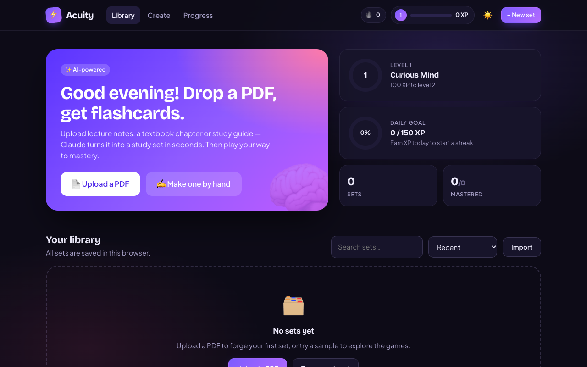
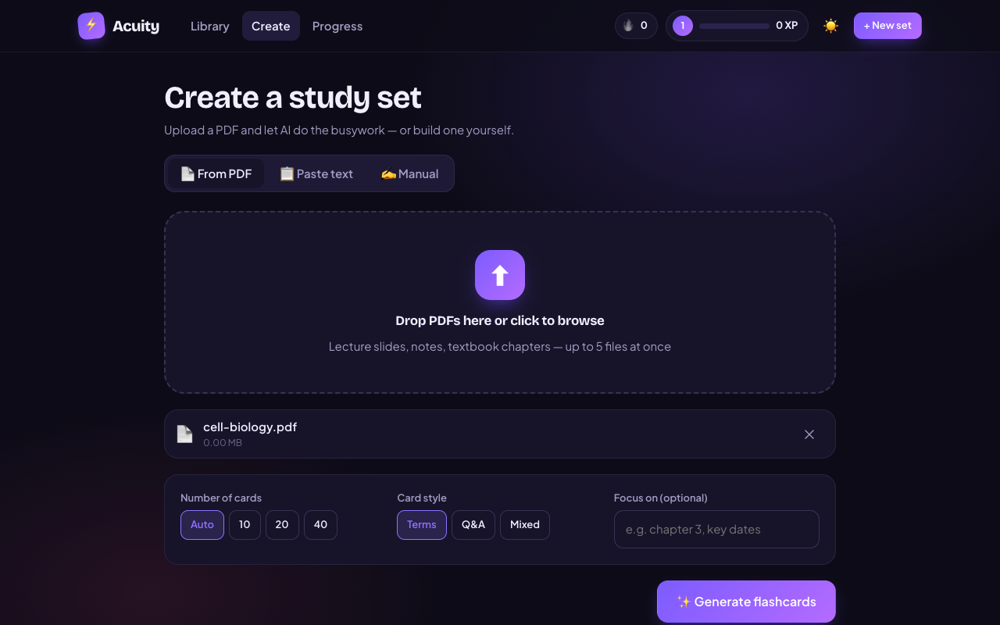
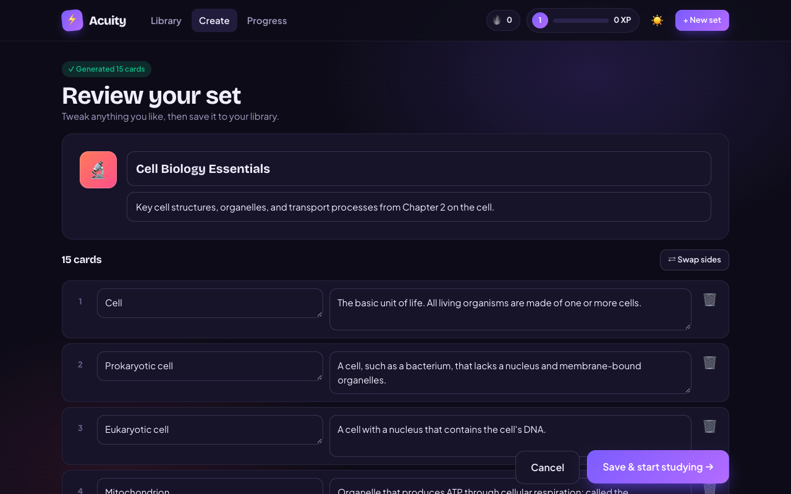
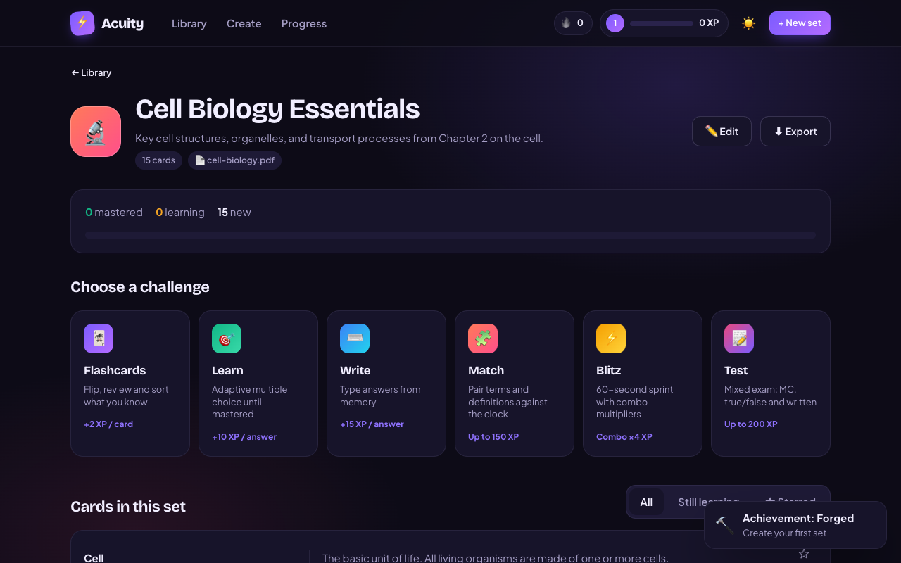
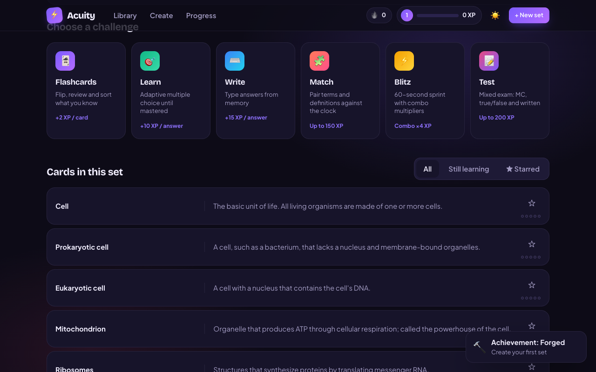
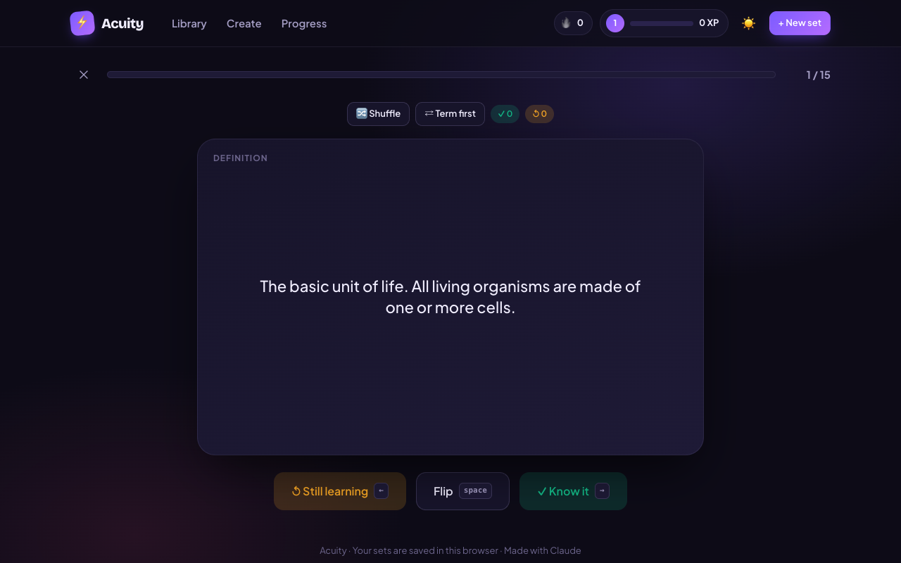
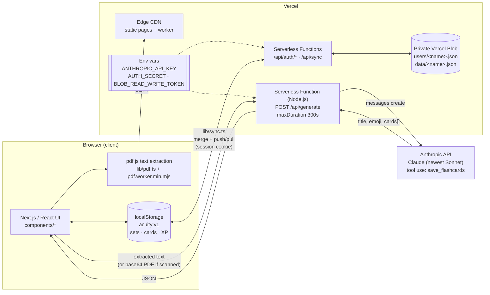
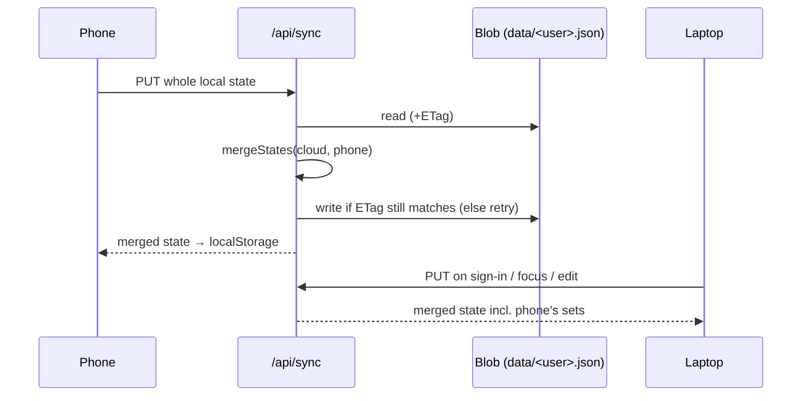

# ⚡ Acuity — PDF to flashcards

Drop in a PDF of lecture notes, a textbook chapter or a study guide. Claude turns it into a flashcard set in seconds, and you study it with six game modes, XP, levels and streaks.

**Live:** https://acuity-study.vercel.app


<sub>Recorded on the live site: `samples/cell-biology.pdf` → 15 cards → Flashcards mode.</sub>

---

## Features

- **PDF → flashcards with AI.** Upload up to 5 PDFs at once, or paste text. Choose the card count (auto, 10, 20 or 40), the style (term/definition, Q&A or mixed) and an optional focus ("chapter 3, key dates").
- **Scanned PDFs work too.** If a PDF has no selectable text, the file is sent to Claude as a document so it can read the pages directly.
- **Review before saving.** Edit, delete, add or swap cards, and rename the set. Claude suggests the title, description and emoji.
- **Six study modes:**

  | Mode | What it does |
  | --- | --- |
  | 🃏 Flashcards | Flip cards and sort them into *know it* or *still learning* (keyboard: Space, ←, →) |
  | 🎯 Learn | Adaptive multiple choice until every card is mastered |
  | ⌨️ Write | Type answers from memory, with typo-tolerant grading |
  | 🧩 Match | Pair terms with definitions against the clock |
  | ⚡ Blitz | 60-second sprint with combo multipliers |
  | 📝 Test | Mixed exam of multiple choice, true/false and written questions |

- **Gamified progress.** XP, levels, a daily goal, streaks, achievements, per-card mastery (0–5) and personal bests.
- **Sync across devices.** Sign in with a username and password and your sets, XP and streaks follow you to your phone, tablet and laptop. Signing in is optional: without it, everything stays in the browser, and you can still export and import JSON backups.
- Light and dark themes, plus a responsive layout.

| | | |
| --- | --- | --- |
|  |  |  |
|  |  |  |

---

## Infrastructure

Acuity is a single Next.js app on Vercel. The browser does most of the work. The server has two jobs: calling Claude, which keeps the API key off the client, and storing each signed-in user's data in a private Vercel Blob store. There's no separate database service.



### Request flow

1. **The PDF is parsed in the browser.** `lib/pdf.ts` loads `pdfjs-dist` and pulls the text from each page. The worker file `public/pdf.worker.min.mjs` is copied from `node_modules` by the `postinstall` script, so Vercel serves it as a static asset. Most PDFs are therefore sent as plain text, which is small, fast and cheap.
2. **Scanned PDFs are the fallback.** If the extracted text has fewer than 200 meaningful characters, a single PDF of up to about 3.2 MB is base64-encoded and sent instead. This stays below Vercel's roughly 4.5 MB request-body limit. The server passes it to Claude as a `document` content block, and Claude reads the pages itself.
3. **`POST /api/generate`** (`app/api/generate/route.ts`) runs as a Node.js serverless function:
   - It truncates text to 180k characters.
   - It picks a model. `ANTHROPIC_MODEL` is used if set. Otherwise it lists the models on the account, takes the newest Sonnet, and caches that choice for the life of the function instance.
   - It calls Claude with a `save_flashcards` tool whose JSON schema is `title`, `description`, `emoji` and `cards[{term, definition}]`, so the output is structured. If Claude answers in plain text instead, the route pulls JSON out of that text.
   - It validates and cleans up the cards, then returns JSON. Errors come back as readable messages: 400, 422, 500 or 502.
4. **The client stores everything locally first.** `lib/store.ts` is a small external store (`useSyncExternalStore`) saved to `localStorage` under `acuity:v1`. Mastery, XP, streaks and achievements are all computed on the client, so the app is instant and works offline.

### Accounts and sync



- **Sign-in** (`app/api/auth/*`). Usernames and passwords are stored at `users/<username>.json` in the Blob store. Passwords are hashed with scrypt and a random salt per user. A session is a cookie: HttpOnly, Secure, SameSite=Lax, valid for a year, and HMAC-signed with `AUTH_SECRET`. It carries a session version (`sv`) that must match the user record, so bumping `sv` signs out every device.
- **Forgot password: recovery codes.** At sign-up, the user gets a 16-character recovery code (about 79 bits, no look-alike characters), shown once. Only its scrypt hash is stored.
  - **Reset** (`/api/auth/reset`): username + code + new password. This sets the new password, replaces the used code with a new one, and bumps `sv`, so every other device is signed out.
  - **New code:** signed-in users can make one from the Account page by re-entering their password (`/api/auth/recovery-code`). The old code stops working.
  - **Unknown usernames** take the same time as real ones (a dummy scrypt), so attempts can't reveal which usernames exist.
  - **If the code is lost too**, the owner can run `node --env-file=.env.local scripts/reset-password.mjs <username>`. It prints a temporary password and a new recovery code.
- **Storage.** Each user's whole app state is one JSON document at `data/<username>.json` in a **private** Vercel Blob store. Only the server can read it, using `BLOB_READ_WRITE_TOKEN`.
- **When it syncs** (`lib/sync.ts`). The free Blob plan includes about 2,000 writes and 10,000 reads a month, so sync is built around writing rarely:
  - **Pulls are read-only:** on load, when the tab regains focus or comes back online, and every 5 minutes while visible.
  - **Pushes happen only when there are local edits.** They're batched: 15 s after the last edit, and at most every 2 minutes during non-stop studying. The app also pushes when it's hidden or closed, using a `keepalive` request.
  - **No-op writes are skipped.** The server compares a fingerprint of the merged state with what's already stored.
  - In testing, creating a set and answering 10 cards produced **one** write.
- **Merging** (`lib/merge.ts`, shared by client and server). Every set carries a `rev` timestamp, stamped automatically on any change, and the newest copy of each set wins. A deleted set leaves a short record of its ID and deletion time, so the delete reaches other devices; these records expire after 6 months. XP, correct answers and session counts take the higher value from each side, achievements are combined, and streaks follow whichever device was active most recently.
- **No lost updates.** The server reads the stored document, merges, and writes back on condition that it hasn't changed since the read (an `ifMatch` ETag check). If another device wrote in between, it re-reads and merges again.
- **Signing in on a device with existing sets** adds them to the account. **Signing out** pushes any final changes and then clears the browser's copy, so a shared device doesn't keep someone's sets. If those last changes can't be pushed, the app warns first.

### Stack

| Layer | Choice |
| --- | --- |
| Framework | Next.js 16 (App Router, Turbopack), React 19, TypeScript |
| AI | `@anthropic-ai/sdk`, Claude with tool use |
| PDF parsing | `pdfjs-dist` 5, legacy build + a small `ReadableStream` polyfill so it works in Safari (in the browser, in a Web Worker) |
| Hosting | Vercel: static CDN plus Node.js serverless functions |
| State | Browser `localStorage`, synced to a private Vercel Blob store (`@vercel/blob`) |
| Auth | Username + password, scrypt hashes, HMAC-signed session cookie (`node:crypto`, no auth library) |
| Styling | Hand-written CSS (`app/globals.css`), Google Fonts |

### Project layout

```
app/
  api/generate/route.ts   # PDF/text → Claude → flashcards
  api/auth/*/route.ts     # signup, login, logout, me, reset, recovery-code
  api/sync/route.ts       # merge + conditional write of a user's state
  layout.tsx, page.tsx    # shell, fonts, theme bootstrap
  globals.css
components/
  App.tsx                 # hash router (#/create, #/set/:id/:mode, …)
  Create.tsx              # upload, generate, review
  Account.tsx             # sign in / sign up / sync status
  SetView.tsx, Editor.tsx, Home.tsx, Profile.tsx, TopBar.tsx, FxLayer.tsx
  modes/                  # Flashcards, Learn, Write, Match, Blitz, Test
lib/
  pdf.ts                  # pdf.js text extraction + base64 fallback
  store.ts                # localStorage store, XP, levels, achievements, rev stamps
  sync.ts                 # client sync engine + account actions
  merge.ts                # pure state merge (client + server)
  server/auth.ts          # scrypt, session cookie signing
  server/db.ts            # JSON documents on private Vercel Blob
  quiz.ts                 # shuffling, grading, distractors, weighted picks
scripts/copy-pdf-worker.mjs
scripts/reset-password.mjs  # owner fallback: reset a user who lost their recovery code
samples/cell-biology.pdf  # try it out
deploy.sh                 # one-command Vercel deploy
```

---

## Run locally

Requires Node 20+ and an [Anthropic API key](https://console.anthropic.com/).

```bash
git clone https://github.com/anfaznil/acuity.git
cd acuity
npm install                       # also copies the pdf.js worker into public/
cp .env.example .env.local        # then add your ANTHROPIC_API_KEY
npx vercel link && npx vercel env pull .env.local   # optional: Blob token for sign-in/sync
npm run dev
```

Open http://localhost:3000 and upload `samples/cell-biology.pdf`. Without `BLOB_READ_WRITE_TOKEN` and `AUTH_SECRET`, the app still works, but only in guest mode (local storage).

### Environment variables

| Variable | Required | Description |
| --- | --- | --- |
| `ANTHROPIC_API_KEY` | yes | Used only by `/api/generate` on the server |
| `ANTHROPIC_MODEL` | no | Pins a model ID. If unset, the newest Sonnet on your account is used |
| `BLOB_READ_WRITE_TOKEN` | for sync | Set automatically when a Blob store is connected to the Vercel project |
| `AUTH_SECRET` | for sync | 32+ random characters that sign session cookies (`openssl rand -base64 48`) |

## Deploy to Vercel

```bash
./deploy.sh
```

The script:

1. logs in to Vercel, opening a browser if needed
2. links the folder to the `acuity-study` project
3. copies `ANTHROPIC_API_KEY` from `.env.local` into the production environment
4. on the first run, creates a private Blob store (`acuity-sync`) and generates `AUTH_SECRET`
5. runs `vercel deploy --prod`

`.vercelignore` keeps `.env*`, `node_modules`, `.next` and `.vercel` out of the upload. Vercel then runs `npm install`, which triggers the `postinstall` worker copy, followed by `next build`.

You can also import the repo in the Vercel dashboard and set `ANTHROPIC_API_KEY` under **Settings → Environment Variables**.

---

Made with [Claude](https://claude.ai).
